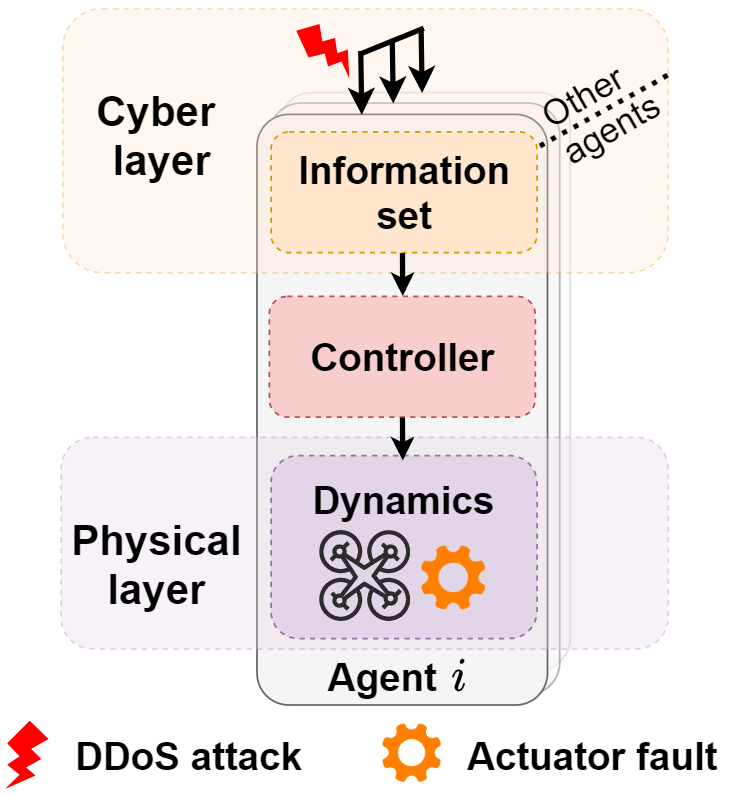

* **研究问题**：负责项目中DDoS攻击、执行器故障、异步通信等作战环境约束下的多无人机编队跟踪问题的调研和解决。
* **理论研究**：为了应对网络层和物理层的混合威胁，引入了基于目标状态估计器的自适应容错分层控制方案，该方案适用于各信道异步通信的P2P网络架构。理论推导出了以有界误差实现编队跟踪的充分条件，并对时间触发通信和持续时间/频率受限的DDoS攻击情况进行了进一步讨论。
* **实验验证**：为了验证算法的有效性，首先进行基于 ROS 和 Gazebo 的物理仿真对比实验；进一步，搭建了基于DJI Tello四旋翼飞行器和自建地面站的实验平台，通过实物无人机编队实验验证了算法的工程可行性。
<!-- [[视频]](https://www.bilibili.com/video/BV1XG4y1k7MX) -->

 